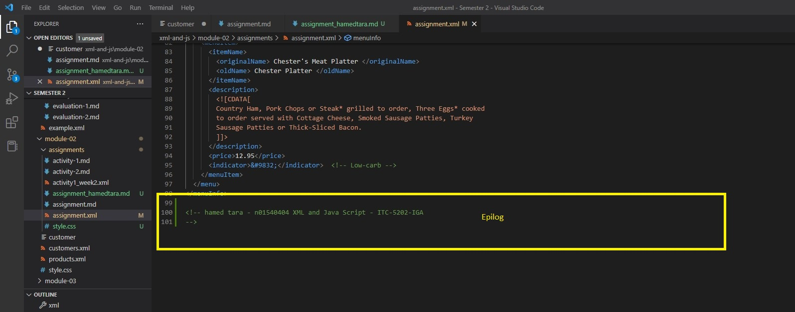
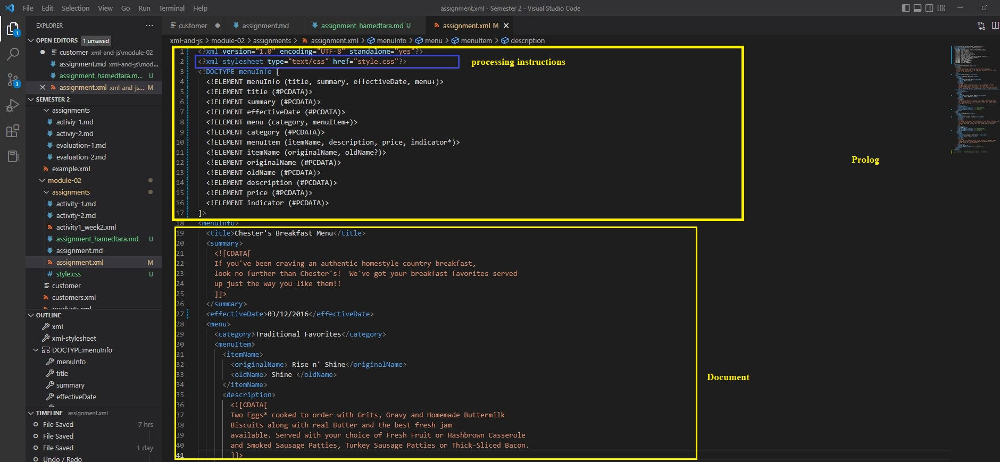

1. Open `module-2/assignments/assignment.xml` in your browser. Are there any errors? Explain the error and fix it. 3 errors:

1.1- Attribute name "Date" associated with an element type "effective" must be followed by the ' = ' character.
the problem is that we should use declare date type correctly like this :
<effectiveDate>03/12/2016</effectiveDate>

1.2- The element type "originalName" must be terminated by the matching end-tag "</originalName>"

The problem is that we should use exactly the tag name like this :
<originalName> Fresh Mornin' Sampler </originalName>

1.3-The element type "name" must be terminated by the matching end-tag "</name>".

It should be like this:
<name> Oatmeal Breakfast</name>

2. What is the use of CDATA block in this document?

CDATA or Character Data, It is used to mark a section of an XML document so that the XML parser interprets it only as character data and not as markup

 <![CDATA[
    If you've been craving an authentic homestyle country breakfast,
    look no further than Chester's!  We've got your breakfast favorites served
    up just the way you like them!!
    ]]>

3. Add comment line to the end of file which contains you name and student id

<!-- hamed tara - n01540404 XML and Java Script - ITC-5202-IGA -
-->

4. Identify prolog, document body, and epilog in the document. Are there any processing instructions?

