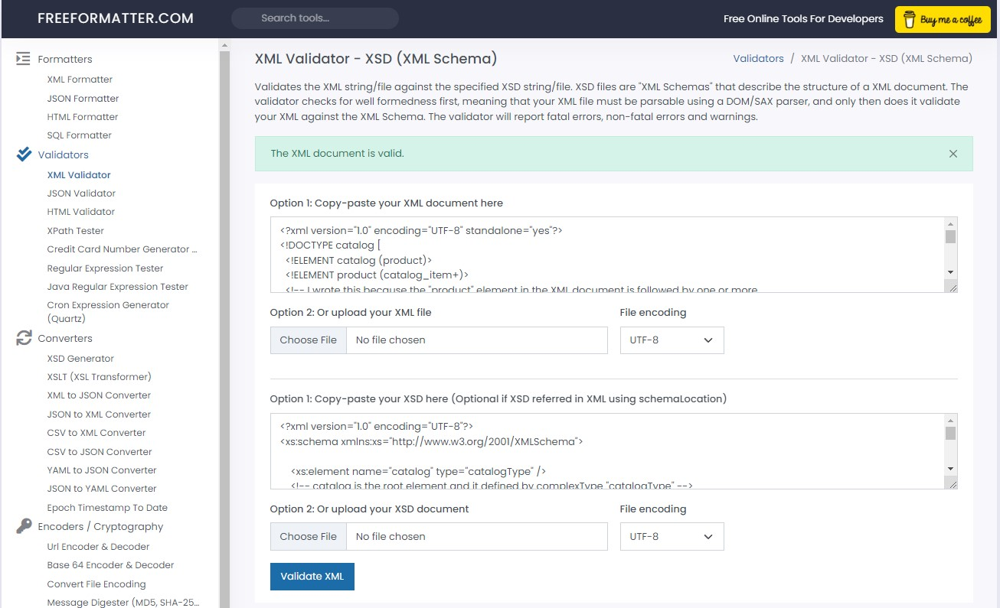

<!DOCTYPE catalog [
  <!ELEMENT catalog (product)>
  <!ELEMENT product (catalog_item+)>
  <!-- I wrote this because the "product" element in the XML document is followed by one or more
  "catalog_item" elements.-->
  <!ATTLIST product product_id ID #REQUIRED>
  <!ATTLIST product description CDATA #REQUIRED>
  <!ATTLIST product product_image CDATA #REQUIRED>
  <!-- I wrote this to specify that the "product" element must have three attributes:
  "product_id","description", "product_image", and all of them are required for the element to be
  valid.-->
  <!ELEMENT catalog_item (item_number,price,size+)>
  <!-- I wrote this becuase the "catalog_item" in the XML document is followed by mentioned elements  -->
  <!ATTLIST catalog_item gender (Men | Women) #REQUIRED >
  <!-- I wrote this to specify that the "catalog_item" element must have an attribute which is
  called gender and gender valuse must be Men or women-->
  <!ELEMENT item_number (#PCDATA)>
  <!ELEMENT price (#PCDATA)>
  <!-- I wrote these becuase item_number and price contain  parsed character data  (String) -->

  <!ELEMENT size (color_swatch+)>
  <!-- I wrote this because the "size" element in the XML document is followed by one or more
  "color_swatch" elements.-->
  <!ATTLIST size description CDATA #REQUIRED>
  <!-- I wrote this to specify that the attribute "description" is added for the "size" element
  because it provides additional information about the size of the product.  -->
  <!ELEMENT color_swatch (#PCDATA)>
  <!ATTLIST color_swatch image CDATA #REQUIRED>

]>

---

The description that how I wrote XSD is on the XSD file as comments

