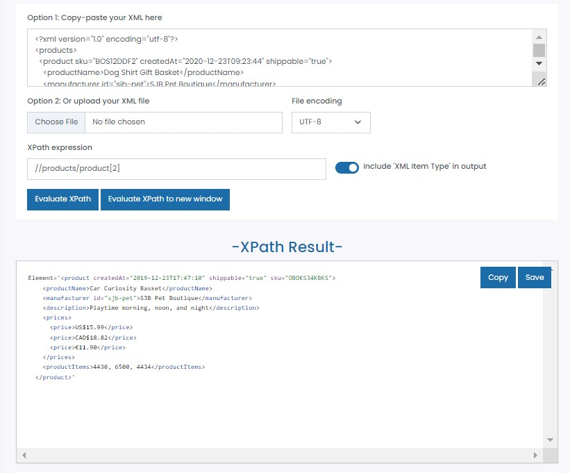
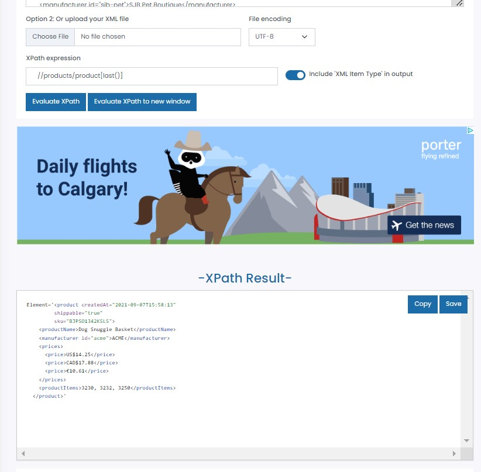
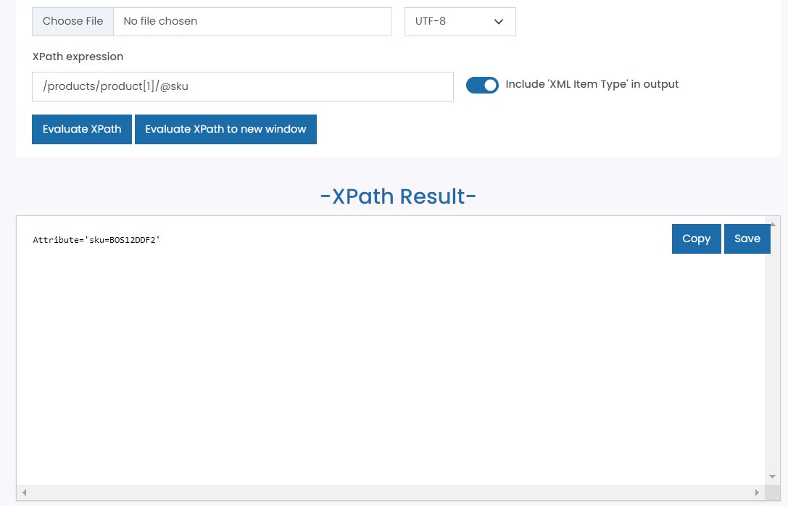

1. Target 2nd product in the list:
   //products/product[2]
   
2. Target last product in the list:
   //products/product[last()]
   
3. Target `sku` attribute of the first product:
   //products/product[1]/@sku
   
4. Target all products with manufacturer id `sjb-pet`
   //product[manufacturer/@id='sjb-pet']
   .jpg>)
   //manufacturer[@id='sjb-pet']/parent::product
   .jpg>)
